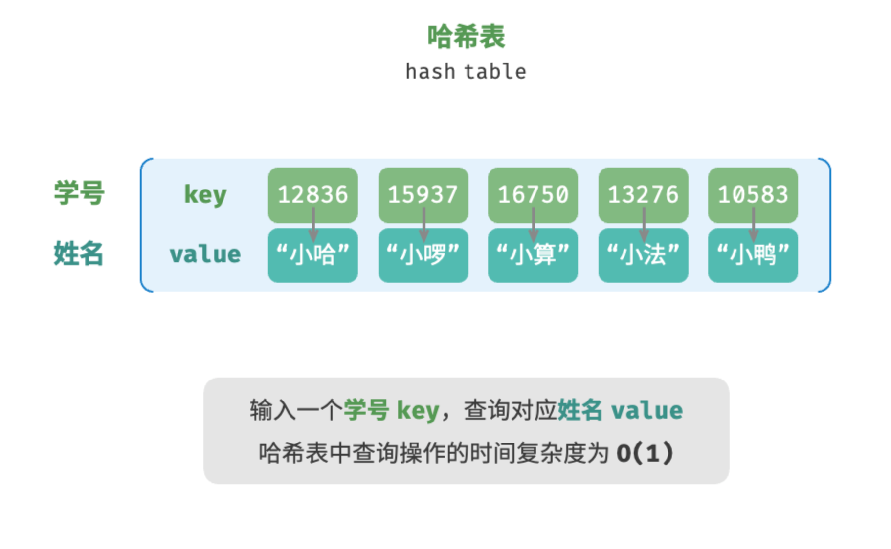
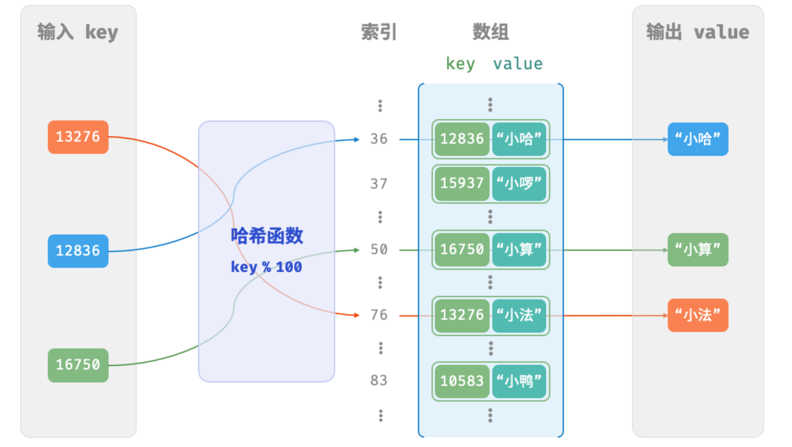
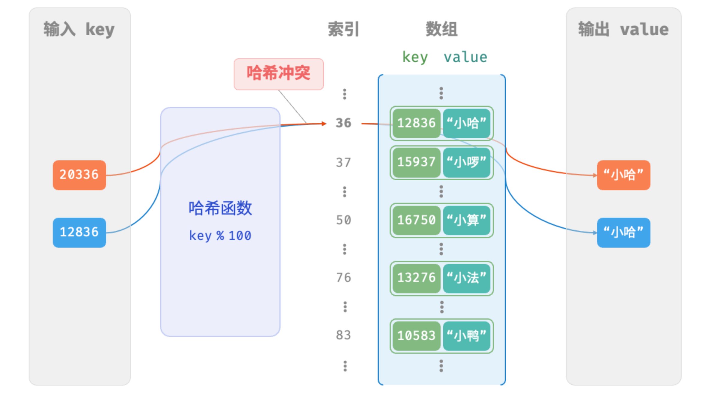

# 1、哈希表定义

哈希表（hash table），又称散列表，它通过建立键 `key` 与值 `value` 之间的映射，实现高效的元素查询。具体而言，我们向哈希表中输入一个键 `key` ，则可以在 时间内获取对应的值 `value` 。

如下图所示，给定 个学生，每个学生都有“姓名”和“学号”两项数据。假如我们希望实现“输入一个学号，返回对应的姓名”的查询功能，则可以采用下图所示的哈希表来实现。



和数组、链表一样，哈希表也可以支持查找、添加及删除等操作，其操作复杂度如下表对比所示：

* 添加元素：数组和链表在尾部可直接添加元素，因此复杂度是O(1)
* 查找元素：数组和链表需要遍历整个数据结构来查找目标元素，因此复杂度是O(n)
* 删除元素：删除指定元素前，需要先找到该元素，因此复杂度是O(n)

|          | 数组 | 链表 | 哈希表 |
| -------- | ---- | ---- | ------ |
| 查找元素 | O(n) | O(n) | O(1)   |
| 添加元素 | O(1) | O(1) | O(1)   |
| 删除元素 | O(n) | O(n) | O(1)   |

因此，可以发现的是，哈希表在进行增删改查时复杂度都是O(1)，操作效率非常高！

# 2、哈希表的常用操作

哈希表的常见操作包括：初始化、查询操作、添加键值对和删除键值对等，示例代码如下：

```python
# 哈希表的常见操作包括：初始化、查询操作、添加键值对和删除键值对等

# 初始化哈希表
# {学号: 姓名}
hmap:dict[int, str] = {}
# hmap = dict()

# 添加键值对
hmap[1001] = "小哈"
hmap[1002] = "小啰"
hmap[1003] = "小算"
hmap[1004] = "小法"
hmap[1005] = "小鸭"

# 查询操作
# 获取学号是 1004的学生信息
print(f"学生是 1004的学生姓名是：{hmap.get(1004)}")
print(f"学生是 1004的学生姓名是：{hmap[1004]}")

# 删除键值对
hmap.pop(1002)
del hmap[1001]
print(hmap)

# 遍历哈希表
# 方式一：同时获取键值对
print("方式一：同时获取键值对")
for key, val in hmap.items():
    print(f"{key} -> {val}", end="\n")
# 方式二：通过 key获取 val
print("# 方式二：通过 key获取 val")
for key in hmap.keys():
    print(f"{key} -> {hmap[key]}")

# 清空哈希表
hmap.clear()

# 删除哈希表
del hmap
# print(hmap)

```

# 3、哈希表的简单实现

我们先考虑最简单的方式--仅仅使用一个数组来实现哈希表。在哈希表中，数组中的一个空位就是一个“桶”（bucket），每个桶可以存放一个键值对。哈希表通过哈希函数`hash(key)`来计算键值对应该存放在数组的索引位置。因而对于查询操作，先通过key对应的桶，再从桶中获取键值对对应的val值。

输入一个key，哈希函数的计算步骤有以下两个步骤：

1、通过某种哈希算法得到hash值

2、将hash值与数组容量`capacity`进行求模运算，所得到的结果就是key在数组中的索引位置

```text
index = hash(key) % capacity
```

随后，我们就可以利用 `index` 在哈希表中访问对应的桶，从而获取 `value` 。

设数组长度 `capacity = 100`、哈希算法 `hash(key) = key` ，易得哈希函数为 `key % 100` 。在下图示例中， 以 `key` 学号和 `value` 姓名为例，展示了哈希函数的工作原理。



下面代码实现了简单哈希表数据结构及常用方法，这里通过Pair类定义了键值对：

```python
"""下面简单实现一个自定义的 hash 表，其中将 key 和 val 封装成一个 Pair 类来表示键值对"""

class Pair:
    def __init__(self, key: int, val: str):
        self.key = key
        self.val = val

class ArrayHashMap:

    def __init__(self):
        """构造方法"""
        # 初始化 100个桶
        self.buckets: list[Pair | None] = [None] * 100

    def hash_func(self, key: int):
        """计算 key 的 hash 值"""
        index = key % len(self.buckets)
        return index

    def get(self, key: int):
        """根据 key 获取 val"""
        index = self.hash_func(key)
        pair: Pair = self.buckets[index]
        return pair.val if pair else None

    def put(self, key: int, val: str):
        """更新键值对"""
        pair: Pair = Pair(key, val)
        index = self.hash_func(key)
        self.buckets[index] = pair

    def remove(self, key: int):
        """删除操作"""
        index = self.hash_func(key)
        self.buckets[index] = None

    def entry_set(self):
        """获取所有键值对"""
        pairs: list[Pair] = []
        for pair in self.buckets:
            if pair is not None:
                pairs.append(pair)
        return pairs

    def keys(self):
        """获取所有的键值"""
        keys: list[int] = []
        for pair in self.buckets:
            if pair:
                keys.append(pair.key)
        return keys

    def values(self):
        """"获取所有的 val 值"""
        values: list[str] = []
        for pair in self.buckets:
            if pair:
                values.append(pair.val)
        return values

    def print(self):
        """打印所有键值对信息"""
        for pair in self.buckets:
            if pair:
                print(f"{pair.key} -> {pair.val}")


"""测试代码"""
if __name__ == "__main__":
    # 初始化哈希表
    hmap = ArrayHashMap()

    # 添加操作
    # 在哈希表中添加键值对 (key, value)
    hmap.put(12836, "小哈")
    hmap.put(15937, "小啰")
    hmap.put(16750, "小算")
    hmap.put(13276, "小法")
    hmap.put(10583, "小鸭")
    print("\n添加完成后，哈希表为\nKey -> Value")
    hmap.print()

    # 查询操作
    # 向哈希表中输入键 key ，得到值 value
    name = hmap.get(15937)
    print("\n输入学号 15937 ，查询到姓名 " + name)

    # 删除操作
    # 在哈希表中删除键值对 (key, value)
    hmap.remove(10583)
    print("\n删除 10583 后，哈希表为\nKey -> Value")
    hmap.print()

    # 遍历哈希表
    print("\n遍历键值对 Key->Value")
    for pair in hmap.entry_set():
        print(pair.key, "->", pair.val)

    print("\n单独遍历键 Key")
    for key in hmap.keys():
        print(key)

    print("\n单独遍历值 Value")
    for val in hmap.values():
        print(val)

```

# 4、哈希冲突与扩容

从上面我们知道了哈希函数的作用是将key映射到数组上的索引上，但往往数组桶的数量是有限的，而输入数据的规模是远大于这个桶数量的，因此就会很容易发生hash冲突，也就是多个key有可能命中了同一个桶。下面继续以上面的学生例子进行举例来说明hash冲突：

学生1：20336：小哈

学生2：12836：小明

```
index1 = 20336 % 100 = 36
index2 = 12836 % 100 = 36
```

但两个学号计算出来的桶索引都是36，找到的都是小哈，就会认为是同一个学生，很明显这与实际情况是冲突的。像这样的，多个输入对应同一输出的情况成为**哈希冲突**。



容易想到，哈希表容量 越大，多个 `key` 被分配到同一个桶中的概率就越低，冲突就越少。因此，**我们可以通过扩容哈希表来减少哈希冲突**。

但这种方式缺点就是数组扩容的缺点，哈希表扩容首先要创建原先数组 n 倍大小新数组，再将旧哈希表中的数据拷贝到新哈希表中。且哈希表因为数组容量发生变化，原先旧数据的 hash 值需要重新计算得到新的桶位置，从而进一步加大了扩容的开销。为此，编程语言通常会预留足够大的哈希表容量，防止频繁扩容。

负载因子（load factor）是哈希表的一个重要概念，其定义为哈希表的元素数量除以桶数量，用于衡量哈希冲突的严重程度，**也常作为哈希表扩容的触发条件**。例如在 Java 中，当负载因子超过 0.75 时，系统会将哈希表扩容至原先的 2 倍。
