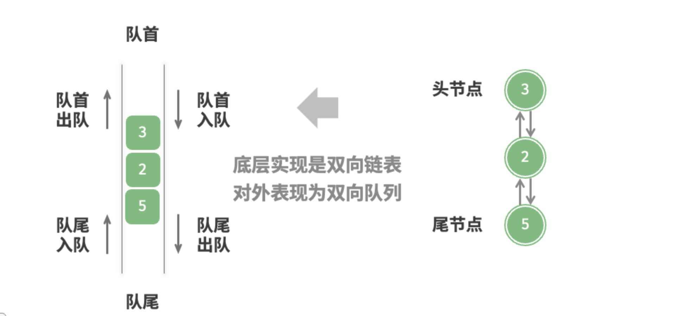

# 1、定义

在队列中，仅允许在队列尾部添加元素、在队列首部删除元素。而双向队列同时允许在队列尾部删除元素、在队列头部添加元素。基于这种特性，双向队列可以同时被当做队列和栈两种数据结构来使用。

```python
# 队列或栈初始化
que: deque[int] = deque()
stack: deque[int] deque()
```

# 2、双向队列常用操作

双向队列的常用操作如下面的表格所示，具体的方法名称需要根据所使用的编程语言来确定。

| 方法名         | 描述             | 时间复杂度 |
| -------------- | ---------------- | ---------- |
| `push_first()` | 将元素添加至队首 | O(1)       |
| `push_last()`  | 将元素添加至队尾 | O(1)       |
| `pop_first()`  | 删除队首元素     | O(1)       |
| `pop_last()`   | 删除队尾元素     | O(1)       |
| `peek_first()` | 访问队首元素     | O(1)       |
| `peek_last()`  | 访问队尾元素     | O(1)       |

大多数编程语言已经内置实现了双向队列类，比如我们这里使用的Python语言使用示例：
```python

from collections import deque

"""测试代码"""
if __name__ == "__main__":
    # 初始化双向队列
    deq: deque[int] = deque()

    # 元素入队
    deq.append(2)  # 添加至队尾
    deq.append(5)
    deq.append(4)
    deq.appendleft(3)  # 添加至队首
    deq.appendleft(1)
    print("双向队列 deque =", deq)

    # 访问元素
    front: int = deq[0]  # 队首元素
    print("队首元素 front =", front)
    rear: int = deq[-1]  # 队尾元素
    print("队尾元素 rear =", rear)

    # 元素出队
    pop_front: int = deq.popleft()  # 队首元素出队
    print("队首出队元素  pop_front =", pop_front)
    print("队首出队后 deque =", deq)
    pop_rear: int = deq.pop()  # 队尾元素出队
    print("队尾出队元素  pop_rear =", pop_rear)
    print("队尾出队后 deque =", deq)

    # 获取双向队列的长度
    size: int = len(deq)
    print("双向队列长度 size =", size)

    # 判断双向队列是否为空
    is_empty: bool = len(deq) == 0
    print("双向队列是否为空 =", is_empty)

```
# 3、双向队列自定义实现

双向队列的实现与队列的实现类似，也可以基于链表或数组进行实现。

## 3.1、基于链表实现双向队列

再上一个章节《队列》中，我们使用单向链表实现队列数据结构，但对于双向队列，需要支持队首队尾添加或删除元素，因此链表需要支持能够向前向后遍历。在节点类ListNode中再添加一个字段`prev`表示指向前驱结点的指针。

* 双向队列的数据结构



* 从队尾添加元素


* 从队首添加元素


* 从队尾删除元素


* 从队首删除元素


基于双向链表实现的双向队列示例代码如下：

```python
"""
双向队列支持从队首、队尾分别添加和删除元素，因此对于链表来说，需要在添加一个指针prev，代表指向前驱节点
"""


class ListNode:
    def __init__(self, val: int):
        """构造方法"""
        self.val: int = val
        self.next: ListNode | None = None  # 指向后继节点
        self.prev: ListNode | None = None  # 指向前驱节点


class LinkedListDeque:
    """基于链表实现的双向队列"""

    def __init__(self):
        """构造方法"""
        self._front: ListNode | None = None  # 头指针
        self._rear: ListNode | None = None  # 尾指针
        self._size: int = 0  # 队列长度

    def size(self):
        """队列长度"""
        return self._size

    def is_empty(self) -> bool:
        """队列是否为空"""
        return self.size() == 0

    def _append(self, val: int, is_front: bool):
        """
        向队列添加元素
        :is_front: 是否从队首添加元素，否则从队尾添加
        """
        node = ListNode(val)
        # 首次添加
        if self.is_empty():
            self._front = node
            self._rear = node
        elif is_front:  # 队首添加
            tmp = self._front
            node.next = tmp
            tmp.prev = node
            self._front = node
        else:  # 队尾添加
            tmp = self._rear
            tmp.next = node
            node.prev = tmp
            # 更新尾指针
            self._rear = node
        self._size += 1

    def append_last(self, val: int):
        """从队尾添加元素"""
        self._append(val, False)

    def append_first(self, val: int):
        """从队首添加元素"""
        self._append(val, True)

    def _pop(self, is_front: bool):
        """
        元素出队
        :is_front:表示是否从队首出队
        """
        if self.is_empty():
            raise IndexError("队列为空")
        if is_front:
            val = self._front.val
            next: ListNode | None = self._front.next
            if next:
                next.prev = None
            # 更新头指针
            self._front = next
        else:
            val = self._rear.val
            prev = self._rear.prev
            if prev:
                prev.next = None
            # 更新尾指针
            self._rear = prev
        self._size -= 1
        return val

    def pop_last(self):
        """从队尾删除元素"""
        return self._pop(False)

    def pop_first(self):
        """从队首删除元素"""
        return self._pop(True)

    def peek_last(self):
        """从队尾查看元素"""
        if self.is_empty():
            raise IndexError("队列为空")
        return self._rear.val

    def peek_first(self):
        """从队首查看元素"""
        if self.is_empty():
            raise IndexError("队列为空")
        return self._front.val

    def to_array(self):
        """将队列转为数组，方便打印"""
        arr: list[int] = []
        # 遍历链表
        tmp = self._front
        while tmp:
            arr.append(tmp.val)
            tmp = tmp.next
        return arr


if __name__ == '__main__':
    deq = LinkedListDeque()
    deq.append_last(1)
    deq.append_last(3)
    deq.append_last(2)
    deq.append_first(5)
    deq.append_first(4)
    print(f"队列元素是： {deq.to_array()}")
    print(f"队首元素是：{deq.peek_first()}")
    print(f"队尾元素是：{deq.peek_last()}")
    print(f"队首弹出元素：{deq.pop_first()}")
    print(f"队尾弹出元素：{deq.pop_last()}")
    print(f"此时队列长度为：{deq.size()}")

```


## 3.2、基于数组实现双向队列

与基于数组实现队列一样，也可以基于环形数组实现双向队列。这里我们把计算 front、rear 索引位置专门抽取一个单独的方法出来方便复用。

> 注意环形数组的特性，当 rear索引到达数组末尾，下一次索引通过求余操作跳转到数组头部；当 front 指针到达数组头部，再通过求余操作跳转到数组尾部。

* 基于环形数组实现双向队列


* 队尾添加元素


* 队首添加元素


* 队尾删除元素


* 队首删除元素


具体的示例代码如下：

```python
"""
与环形数组实现队列相似，这里可以继续使用环形数组实现双向队列
front表示队首元素的位置
rear表示队尾元素的下一位置，也即下一个元素可以插入的索引位置
"""


class ArrayDeque:
    def __init__(self, size: int):
        """构造器，初始化指定容量的环形数组"""
        self._front: int = 0
        self._rear: int = 0
        self._size: int = 0
        self._arr = [0] * size

    def size(self):
        """队列长度"""
        return self._size

    def capacity(self):
        """队列容量"""
        return len(self._arr)

    def is_empty(self):
        """队列是否为空"""
        return self.size() == 0

    def index(self, i: int) -> int:
        """
        计算i应该在环形数组中的索引位置，当到达队列头部/尾部时，下一次索引位置会跳转到队列尾部/头部
        """
        return (i + self.capacity()) % self.capacity()

    def append_last(self, val: int):
        """从队列尾部添加元素"""
        # 队列是否已满
        if self.size() == self.capacity():
            print("队列已满")
            return
        self._arr[self._rear] = val
        self._size += 1
        self._rear = self.index(self._rear + 1)

    def append_first(self, val: int):
        """从队列头部添加元素"""
        # 队列是否已满
        if self.size() == self.capacity():
            print("队列已满")
            return
        self._front = self.index(self._front - 1)
        self._arr[self._front] = val
        self._size += 1

    def pop_last(self):
        """从队列尾部删除元素"""
        if self.is_empty():
            print("队列为空，无法删除")
            return None
        self._rear = self.index(self._rear + 1)
        val = self._arr[self._rear]
        self._size -= 1
        return val

    def pop_first(self):
        """从队列头部删除元素"""
        if self.is_empty():
            print("队列为空，无法删除")
            return None
        val = self._arr[self._front]
        self._front = self.index(self._front - 1)
        self._size -= 1
        return val
    def peek_last(self):
        """访问队列尾部元素"""
        if self.is_empty():
            raise IndexError("队列为空")
        return self._arr[self.index(self._rear-1)]

    def peek_first(self):
        """访问队列头部元素"""
        if self.is_empty():
            raise IndexError("队列为空")
        return self._arr[self._front]

    def to_array(self):
        """将队列转为数组，便于打印"""
        arr: list[int] = []
        idx = self._front
        for _ in range(self.size()):
            arr.append(self._arr[idx])
            idx = self.index(idx +1)
        return arr

if __name__ == '__main__':
    deq = ArrayDeque(5)
    deq.append_last(1)
    deq.append_last(3)
    deq.append_last(2)
    deq.append_first(5)
    deq.append_first(4)
    print(f"队列元素是： {deq.to_array()}")
    print(f"队首元素是：{deq.peek_first()}")
    print(f"队尾元素是：{deq.peek_last()}")
    print(f"队首弹出元素：{deq.pop_first()}")
    print(f"队尾弹出元素：{deq.pop_last()}")
    print(f"此时队列长度为：{deq.size()}")
```


# 4、双向队列应用

双向队列兼具栈与队列的逻辑，**因此它可以实现这两者的所有应用场景，同时提供更高的自由度**。

我们知道，软件的“撤销”功能通常使用栈来实现：系统将每次更改操作 `push` 到栈中，然后通过 `pop` 实现撤销。然而，考虑到系统资源的限制，软件通常会限制撤销的步数（例如仅允许保存 步）。当栈的长度超过 时，软件需要在栈底（队首）执行删除操作。**但栈无法实现该功能，此时就需要使用双向队列来替代栈**。请注意，“撤销”的核心逻辑仍然遵循栈的先入后出原则，只是双向队列能够更加灵活地实现一些额外逻辑。