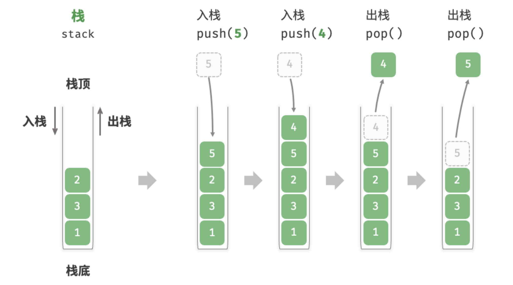
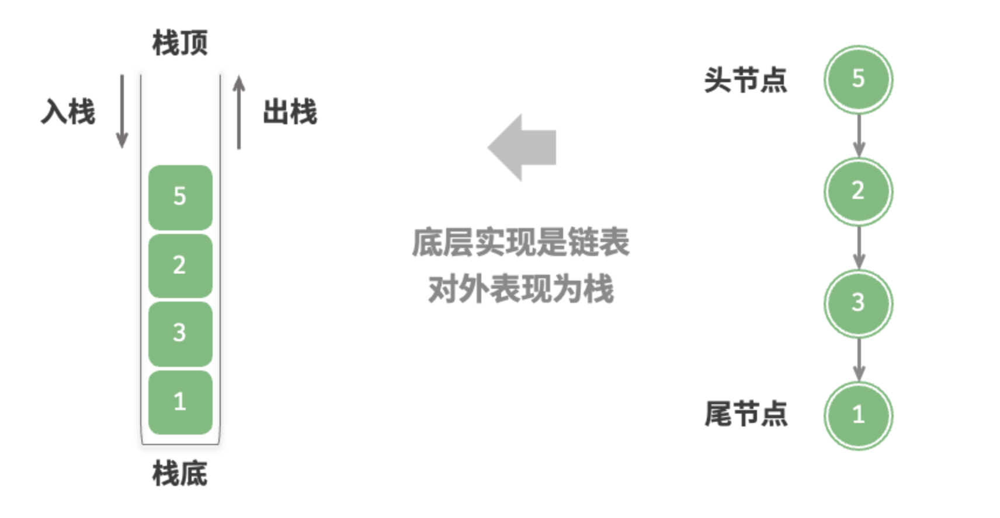
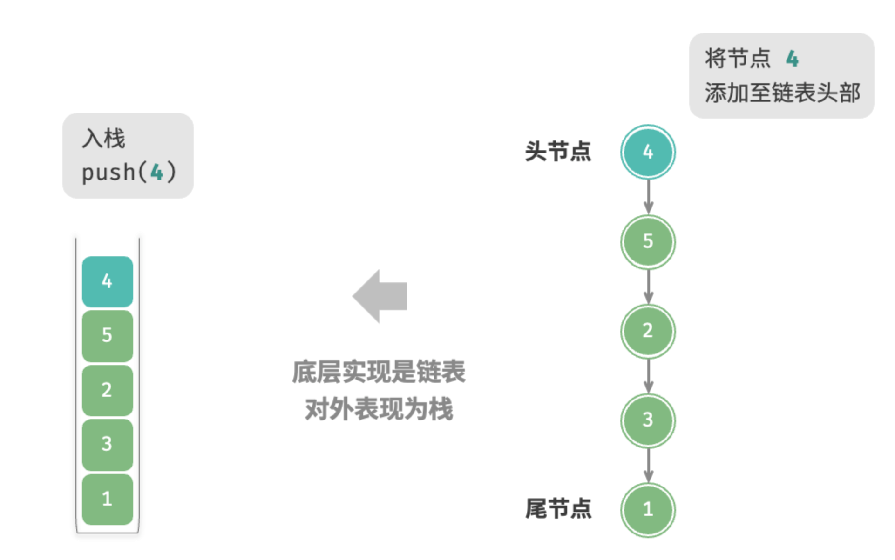
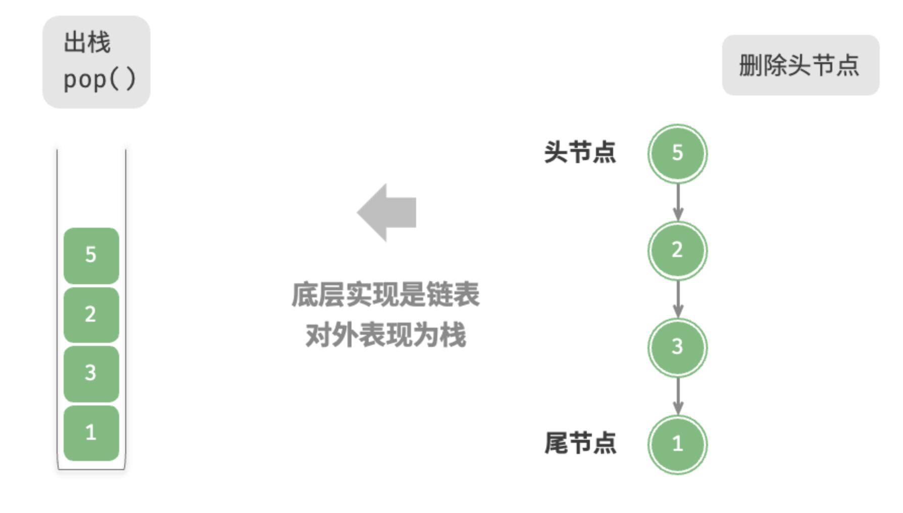
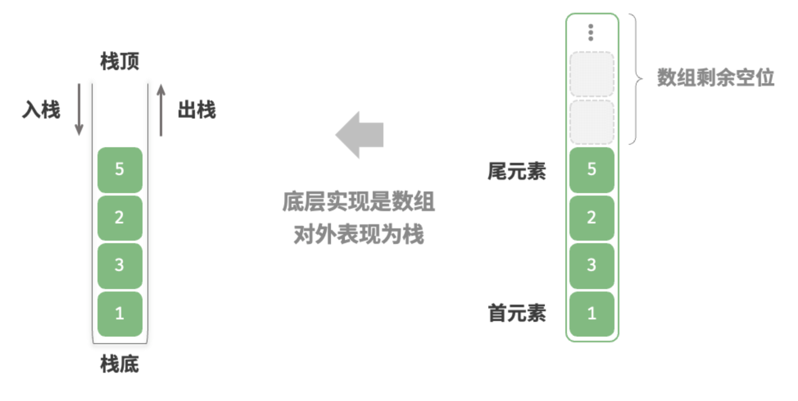
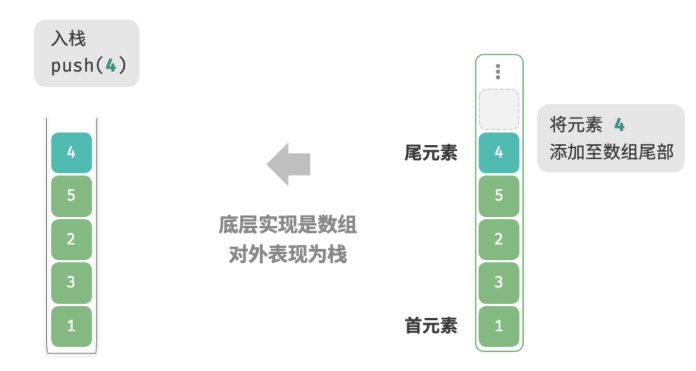
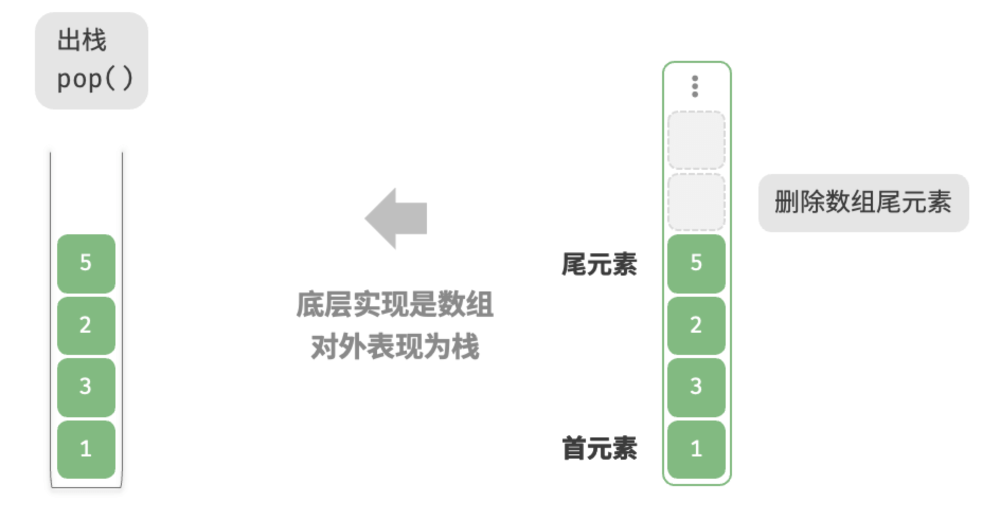

# 1、定义

栈（Stack）是一种遵循先进后出（FILO）逻辑的线性数据结构

如下图所示，一般把堆叠元素的顶部称为栈顶，堆叠元素的底部称为栈低。元素从栈顶入栈，也从栈顶出栈，也就是说，栈数据结构元素的出入都在同一端（队列中的元素入队在一端，出队在另一端）。



# 2、栈的常用操作

栈的常用操作如表 5-1 所示，具体的方法名需要根据所使用的编程语言来确定。在此，我们以常见的 `push()`、`pop()`、`peek()` 命名为例。

| 方法     | 描述                   | 时间复杂度 |
| -------- | ---------------------- | ---------- |
| `push()` | 元素入栈（添加至栈顶） | O(1)       |
| `pop()`  | 栈顶元素出栈           | O(1)       |
| `peek()` | 访问栈顶元素           | O(1)       |

通常情况下，我们可以直接使用编程语言内置的栈类。然而，某些语言可能没有专门提供栈类，这时我们可以将该语言的“数组”或“链表”当作栈来使用，并在程序逻辑上忽略与栈无关的操作。

```python
# 初始化栈
# Python 没有内置的栈类，可以把 list 当作栈来使用
stack: list[int] = []

# 元素入栈
stack.append(1)
stack.append(3)
stack.append(2)
stack.append(5)
stack.append(4)

# 访问栈顶元素
peek: int = stack[-1]

# 元素出栈
pop: int = stack.pop()

# 获取栈的长度
size: int = len(stack)

# 判断是否为空
is_empty: bool = len(stack) == 0
```


# 3、栈的实现

为了更深入的了解栈数据结构的内部实现，我们可以自定义实现一个栈，一般实现栈有两种方式：一种是基于链表的，一种是基于数组实现的。

## 3.1、基于链表的实现

先来看看基于链表的实现方式，基于栈数据结构的特性，对于入栈操作，可以将元素插入链表头部，这种节点插入的方式也称为“头插法”；对于出栈操作，只需要将头节点从链表移出。

* 栈的状态



* 元素入栈



* 元素出栈



以下是基于链表实现的示例代码：

```python
from modules.list_node import ListNode


class LinkedListStack:
    """基于链表实现的栈"""

    def __init__(self):
        """构造方法"""
        self._peek: ListNode | None = None
        self._size: int = 0

    def size(self) -> int:
        """获取栈的长度"""
        return self._size

    def is_empty(self) -> bool:
        """判断栈是否为空"""
        return self._size == 0

    def push(self, val: int):
        """入栈"""
        node = ListNode(val)
        node.next = self._peek
        self._peek = node
        self._size += 1

    def pop(self) -> int:
        """出栈"""
        num = self.peek()
        self._peek = self._peek.next
        self._size -= 1
        return num

    def peek(self) -> int:
        """访问栈顶元素"""
        if self.is_empty():
            raise IndexError("栈为空")
        return self._peek.val

    def to_list(self) -> list[int]:
        """转化为列表用于打印"""
        arr = []
        node = self._peek
        while node:
            arr.append(node.val)
            node = node.next
        arr.reverse()
        return arr

"""测试代码"""
if __name__ == "__main__":
    # 初始化栈
    stack = LinkedListStack()

    # 元素入栈
    stack.push(1)
    stack.push(3)
    stack.push(2)
    stack.push(5)
    stack.push(4)
    print("栈 stack =", stack.to_list())

    # 访问栈顶元素
    peek: int = stack.peek()
    print("栈顶元素 peek =", peek)

    # 元素出栈
    pop: int = stack.pop()
    print("出栈元素 pop =", pop)
    print("出栈后 stack =", stack.to_list())

    # 获取栈的长度
    size: int = stack.size()
    print("栈的长度 size =", size)

    # 判断是否为空
    is_empty: bool = stack.is_empty()
    print("栈是否为空 =", is_empty)
```

上述代码运行结果如下：

```markdown
栈 stack = [1, 3, 2, 5, 4]
栈顶元素 peek = 4
出栈元素 pop = 4
出栈后 stack = [1, 3, 2, 5]
栈的长度 size = 4
栈是否为空 = False
```

## 3.2、基于数组的实现

使用数组实现时，可以将数组的尾部理解为栈顶，如下图所示，入栈与出栈操作分别对应在数组的尾部添加与删除元素，时间复杂度是O(1)。

* 使用数组实现的初始状态



* 数组方式的入栈



* 数组方式的出栈



因为入栈操作可能会有大量的数据进入，因此我们考虑使用动态数组（也就是python中的列表`list`）进行实现，这样不需要我们自己考虑扩容的问题啦。下面是动态数组实现栈的示例代码：

```python

class ArrayStack:
    """基于数组实现的栈"""

    def __init__(self):
        """构造方法"""
        self._stack: list[int] = []

    def size(self) -> int:
        """获取栈的长度"""
        return len(self._stack)

    def is_empty(self) -> bool:
        """判断栈是否为空"""
        return self.size() == 0

    def push(self, item: int):
        """入栈"""
        self._stack.append(item)

    def pop(self) -> int:
        """出栈"""
        if self.is_empty():
            raise IndexError("栈为空")
        return self._stack.pop()

    def peek(self) -> int:
        """访问栈顶元素"""
        if self.is_empty():
            raise IndexError("栈为空")
        return self._stack[-1]

    def to_list(self) -> list[int]:
        """返回列表用于打印"""
        return self._stack


"""Driver Code"""
if __name__ == "__main__":
    # 初始化栈
    stack = ArrayStack()

    # 元素入栈
    stack.push(1)
    stack.push(3)
    stack.push(2)
    stack.push(5)
    stack.push(4)
    print("栈 stack =", stack.to_list())

    # 访问栈顶元素
    peek: int = stack.peek()
    print("栈顶元素 peek =", peek)

    # 元素出栈
    pop: int = stack.pop()
    print("出栈元素 pop =", pop)
    print("出栈后 stack =", stack.to_list())

    # 获取栈的长度
    size: int = stack.size()
    print("栈的长度 size =", size)

    # 判断是否为空
    is_empty: bool = stack.is_empty()
    print("栈是否为空 =", is_empty)

```


# 4、两种实现对比

 **时间效率**

数组实现的优点是使用预先分配好的连续的内存空间，可以很好的利用CPU缓存的特性，因此在访问元素时效率特别高。缺点是入栈操作在容量满时会触发扩容机制，这次入栈的时间复杂度是O(n)

链表实现的优点就是不存在上述扩容的问题，链表的扩容很灵活，只需要修改指针的指向即可。但每次入栈都需要将新元素包装成一个节点对象并修改指针，因此执行效率相较与数组缓慢。

综上所述，当入栈与出栈操作的元素是基本数据类型时，例如 `int` 或 `double` ，我们可以得出以下结论。

- 基于数组实现的栈在触发扩容时效率会降低，但由于扩容是低频操作，因此平均效率更高。
- 基于链表实现的栈可以提供更加稳定的效率表现。

**空间效率**

在初始化列表时，系统会为列表分配“初始容量”，这个初始容量很可能超出列表的实际容量，且列表在扩容时通常是按照特定倍数（2倍、3倍）进行扩容，扩容后的容量也可能超出实际使用的容量。因此数组实现方式可能存在一定内存空间的浪费。

链表虽然不存在上述空闲空间的浪费问题，也可以很好的利用碎片内存空间，但每一个节点对象都有一片内存开销来存储“指针”，因此链表节点占用的内存会更大一些。

综上，我们不能简单地说哪种实现更加节省内存，还是需要针对具体情况进行分析。

# 5、栈的典型应用

- **浏览器中的后退与前进、软件中的撤销与反撤销**。每当我们打开新的网页，浏览器就会对上一个网页执行入栈，这样我们就可以通过后退操作回到上一个网页。后退操作实际上是在执行出栈。如果要同时支持后退和前进，那么需要两个栈来配合实现。
- **程序内存管理**。每次调用函数时，系统都会在栈顶添加一个栈帧，用于记录函数的上下文信息。在递归函数中，向下递推阶段会不断执行入栈操作，而向上回溯阶段则会不断执行出栈操作。