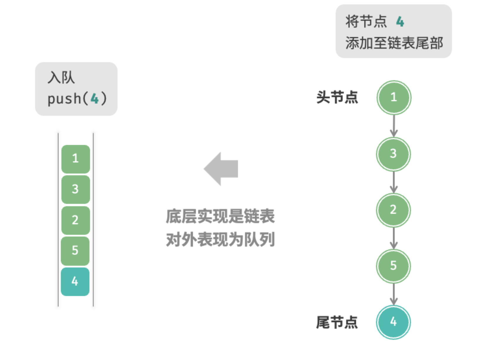

#  1、队列定义

队列（queue）是一种遵循先入先出规则的线性数据结构。顾名思义，队列模拟了排队现象，即新来的人不断加入队列尾部，而位于队列头部的人逐个离开。

我们将队列头部称为“队首”，尾部称为“队尾”，将把元素加入队尾的操作称为“入队”，删除队首元素的操作称为“出队”。


# 2、队列常用操作

队列的常见操作如下面表格所示。需要注意的是，不同编程语言的方法名称可能会有所不同。我们在此采用与栈相同的方法命名。

| 方法名   | 描述                         | 时间复杂度 |
| -------- | ---------------------------- | ---------- |
| `push()` | 元素入队，即将元素添加至队尾 | O(1)       |
| `pop()`  | 队首元素出队                 | O(1)       |
| `peek()` | 访问队首元素                 | O(1)       |

我们可以直接使用编程语言中现成的队列类：

```python
from collections import deque

# 初始化队列
# 在 Python 中，我们一般将双向队列类 deque 当作队列使用
# 虽然 queue.Queue() 是纯正的队列类，但不太好用，因此不推荐
que: deque[int] = deque()

# 元素入队
que.append(1)
que.append(3)
que.append(2)
que.append(5)
que.append(4)

# 访问队首元素
front: int = que[0]

# 元素出队
pop: int = que.popleft()

# 获取队列的长度
size: int = len(que)

# 判断队列是否为空
is_empty: bool = len(que) == 0
```

# 3、队列实现

为了实现队列，我们需要一种数据结构，在一端添加元素，在另一端删除元素。这种特性，链表和数组都能支持实现。

## 3.1、基于链表的实现

如下图所示，我们可以将链表的头节点当作队首，尾节点当作队尾，要求队尾仅能添加新节点，队首仅能删除节点。

* 链表方式实现队列


* 入队操作



* 出队操作


下面是基于链表实现方式的示例代码：

```python
from modules.list_node import ListNode


class LinkedListQueue:
    """基于链表实现的队列"""

    def __init__(self):
        """构造方法"""
        self._front: ListNode | None = None  # 头节点 front
        self._rear: ListNode | None = None  # 尾节点 rear
        self._size: int = 0

    def size(self) -> int:
        """获取队列的长度"""
        return self._size

    def is_empty(self) -> bool:
        """判断队列是否为空"""
        return self._size == 0

    def push(self, num: int):
        """入队"""
        # 在尾节点后添加 num
        node = ListNode(num)
        # 如果队列为空，则令头、尾节点都指向该节点
        if self._front is None:
            self._front = node
            self._rear = node
        # 如果队列不为空，则将该节点添加到尾节点后
        else:
            self._rear.next = node
            self._rear = node
        self._size += 1

    def pop(self) -> int:
        """出队"""
        num = self.peek()
        # 删除头节点
        self._front = self._front.next
        self._size -= 1
        return num

    def peek(self) -> int:
        """访问队首元素"""
        if self.is_empty():
            raise IndexError("队列为空")
        return self._front.val

    def to_list(self) -> list[int]:
        """转化为列表用于打印"""
        queue = []
        temp = self._front
        while temp:
            queue.append(temp.val)
            temp = temp.next
        return queue


"""Driver Code"""
if __name__ == "__main__":
    # 初始化队列
    queue = LinkedListQueue()

    # 元素入队
    queue.push(1)
    queue.push(3)
    queue.push(2)
    queue.push(5)
    queue.push(4)
    print("队列 queue =", queue.to_list())

    # 访问队首元素
    peek: int = queue.peek()
    print("队首元素 front =", peek)

    # 元素出队
    pop_front: int = queue.pop()
    print("出队元素 pop =", pop_front)
    print("出队后 queue =", queue.to_list())

    # 获取队列的长度
    size: int = queue.size()
    print("队列长度 size =", size)

    # 判断队列是否为空
    is_empty: bool = queue.is_empty()
    print("队列是否为空 =", is_empty)
```

## 3.2、基于数组的实现

基于数组方式实现，入队和出队的复杂度都是O(n)，这会导致操作效率变低。然而，可以采用下面这种方式来巧妙解决这个问题：

* `capacity`记录队列的容量
* 定义`size`属性记录队列的长度
* `front`变量记录队首元素的索引位置
* `rear`变量记录下次要插入元素的索引位置，也即是当前队尾元素的下一处

`rear = front + size`，这个公式可以计算出下一次插入元素的索引位置，将插入操作复杂度提升到O(1)

`front = front + 1`，这个公式计算元素出队后，front的索引位置

这样，入队和出队操作复杂度都只有O(1)


可以发现一个问题，如果指针不停的入队、出队，指针会一直往后面移动，移动到队尾就无法继续移动了。为了解决这个问题，我们考虑使用环形数组来解决这个问题。

为了使用“环形”的效果，需要调整上面的公式：

* 入队后更新尾指针：`rear = (front + size) % capacity`
* 出队后更新头指针：`front = (front + 1) % capacity`

下面是通过环形数组实现队列的示例代码：

```python
class ArrayQueue:
    """基于环形数组实现的队列"""

    def __init__(self, size: int):
        """构造方法"""
        self._nums: list[int] = [0] * size  # 用于存储队列元素的数组
        self._front: int = 0  # 队首指针，指向队首元素
        self._size: int = 0  # 队列长度

    def capacity(self) -> int:
        """获取队列的容量"""
        return len(self._nums)

    def size(self) -> int:
        """获取队列的长度"""
        return self._size

    def is_empty(self) -> bool:
        """判断队列是否为空"""
        return self._size == 0

    def push(self, num: int):
        """入队"""
        if self._size == self.capacity():
            raise IndexError("队列已满")
        # 计算队尾指针，指向队尾索引 + 1
        # 通过取余操作实现 rear 越过数组尾部后回到头部
        rear: int = (self._front + self._size) % self.capacity()
        # 将 num 添加至队尾
        self._nums[rear] = num
        self._size += 1

    def pop(self) -> int:
        """出队"""
        num: int = self.peek()
        # 队首指针向后移动一位，若越过尾部，则返回到数组头部
        self._front = (self._front + 1) % self.capacity()
        self._size -= 1
        return num

    def peek(self) -> int:
        """访问队首元素"""
        if self.is_empty():
            raise IndexError("队列为空")
        return self._nums[self._front]

    def to_list(self) -> list[int]:
        """返回列表用于打印"""
        res = [0] * self.size()
        j: int = self._front
        for i in range(self.size()):
            res[i] = self._nums[(j % self.capacity())]
            j += 1
        return res
```

以上实现的队列仍然具有局限性：其长度不可变。然而，这个问题不难解决，我们可以将数组替换为动态数组，从而引入扩容机制。有兴趣的读者可以尝试自行实现。

# 4、队列应用

- **淘宝订单**。购物者下单后，订单将加入队列中，系统随后会根据顺序处理队列中的订单。在双十一期间，短时间内会产生海量订单，高并发成为工程师们需要重点攻克的问题。
- **各类待办事项**。任何需要实现“先来后到”功能的场景，例如打印机的任务队列、餐厅的出餐队列等，队列在这些场景中可以有效地维护处理顺序。